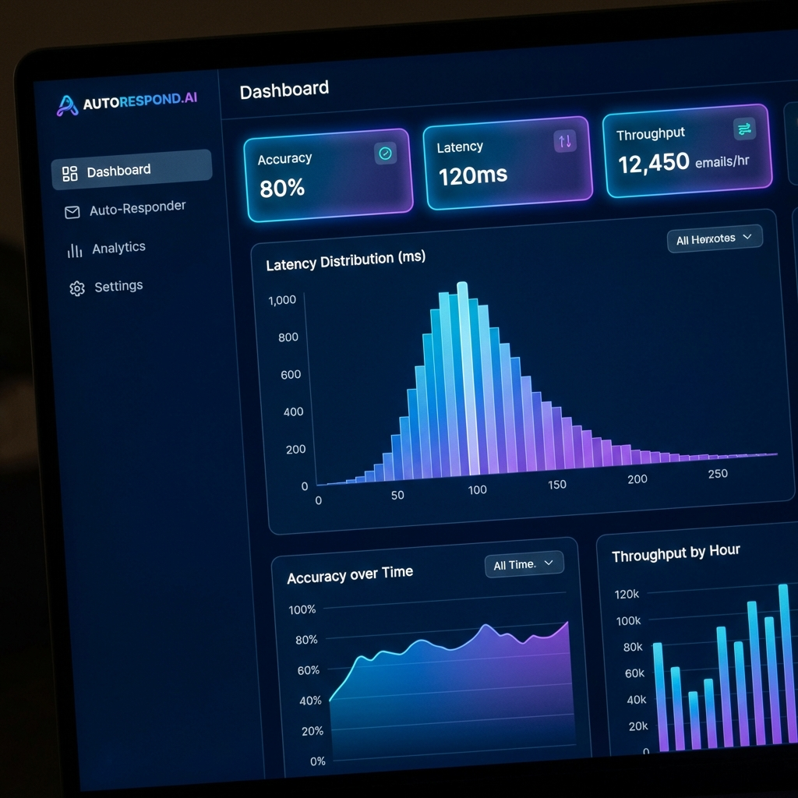
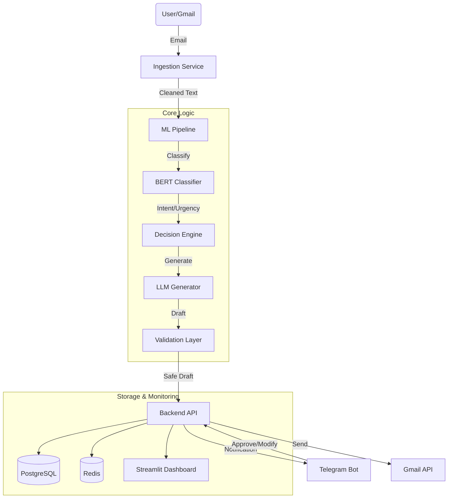

# 📧 Smart Email Auto-Responder


A context-aware AI system that automatically classifies incoming emails, detects urgency and tone, and generates safe, confidence-based replies with human-in-the-loop escalation.



---

## 🚀 Features

- **🔍 Intelligent Classification**:  
  Uses fine-tuned BERT models to categorize emails by **Intent** (e.g., meeting, academic), **Urgency** (High/Low), and **Sentiment** (Positive/Negative/Aggressive).

- **✍️ Generative AI Responses**:  
  Drafts context-aware replies using **T5/FLAN-T5** models and RAG (Retrieval-Augmented Generation) for accuracy.

- **🛡️ Safety & Validation Layer**:  
  Includes confidence checks, PII filtering, and tone analysis to ensuring every generated draft is safe.

- **🤖 Human-in-the-Loop**:  
  Seamless integration with **Telegram** for real-time draft approval, modification, or rejection.

- **📊 Analytics Dashboard**:  
  Real-time monitoring of system performance, latency, and classification accuracy.

---

## 🏗️ Architecture

The system follows a microservices architecture to ensure scalability and maintainability.



See [Architecture Documentation](docs/architecture.md) for deep dive.

---

## 🛠️ Technology Stack

| Component | Technology | Description |
|-----------|------------|-------------|
| **Backend** |  | High-performance async API |
| **ML Models** |   | BERT for classification, T5 for generation |
| **Database** |  | Robust relational storage |
| **Caching** |  | High-speed cache & queues |
| **Containerization** |  | Full stack containerization |
| **Dashboard** |  | Interactive evaluation metrics |

---

## 🏁 Quick Start

### Prerequisites
- Docker & Docker Compose
- Python 3.10+ (for local dev)
- Gmail API Credentials (`credentials.json`)
- Telegram Bot Token

### 1. Clone Repository
```bash
git clone https://github.com/afrit-med-rayan/smart-email-auto-responder.git
cd smart-email-auto-responder
```

### 2. Configure Environment
```bash
cp .env.example .env
# Open .env and add your API keys
```

### 3. Run with Docker
```bash
docker-compose up --build -d
```
Access the dashboard at `http://localhost:8501` and the API docs at `http://localhost:8000/docs`.

---

## 📚 Documentation

- **[Architecture](docs/architecture.md)**: Detailed system design.
- **[Deployment Guide](docs/deployment.md)**: Production setup instructions.
- **[Design Decisions](docs/design_decisions.md)**: Trade-offs and technology choices.
- **[Technical Blog](docs/technical_blog.md)**: "Building a Smart Email Auto-Responder".
- **[Evaluation Report](EVALUATION.md)**: Latest model performance metrics.

---

## 📸 Screenshots

### Evaluation Dashboard
Visualize model performance metrics including F1-score, BLEU score, and system latency.


---

## 📄 License
MIT License. See [LICENSE](LICENSE) for details.
