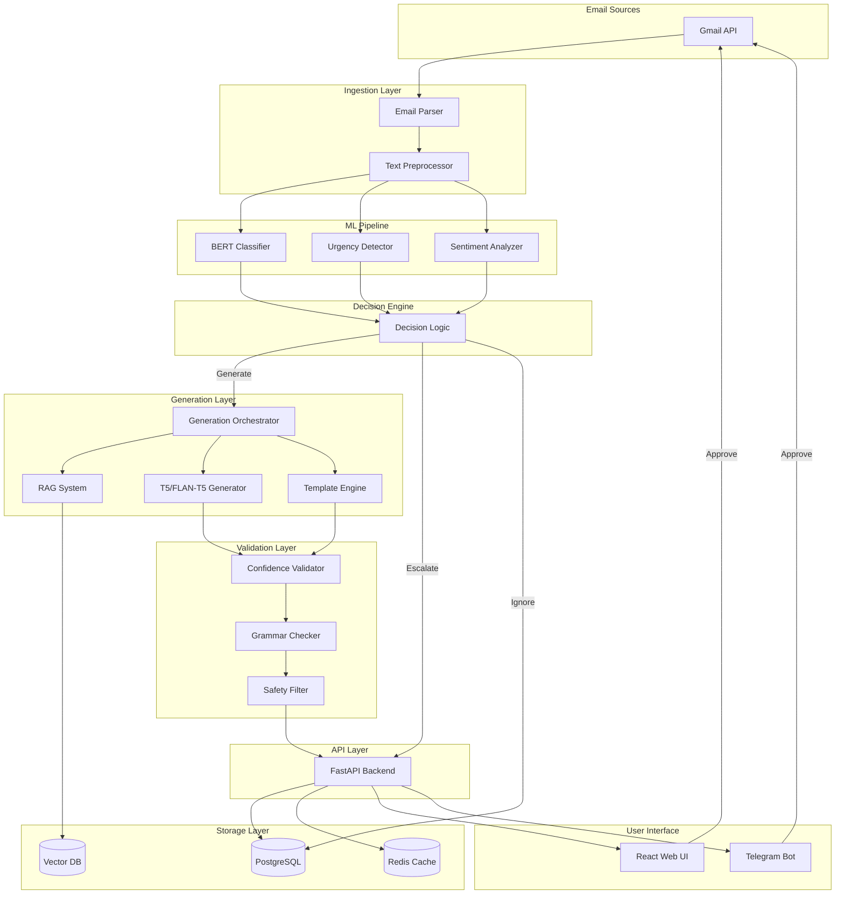
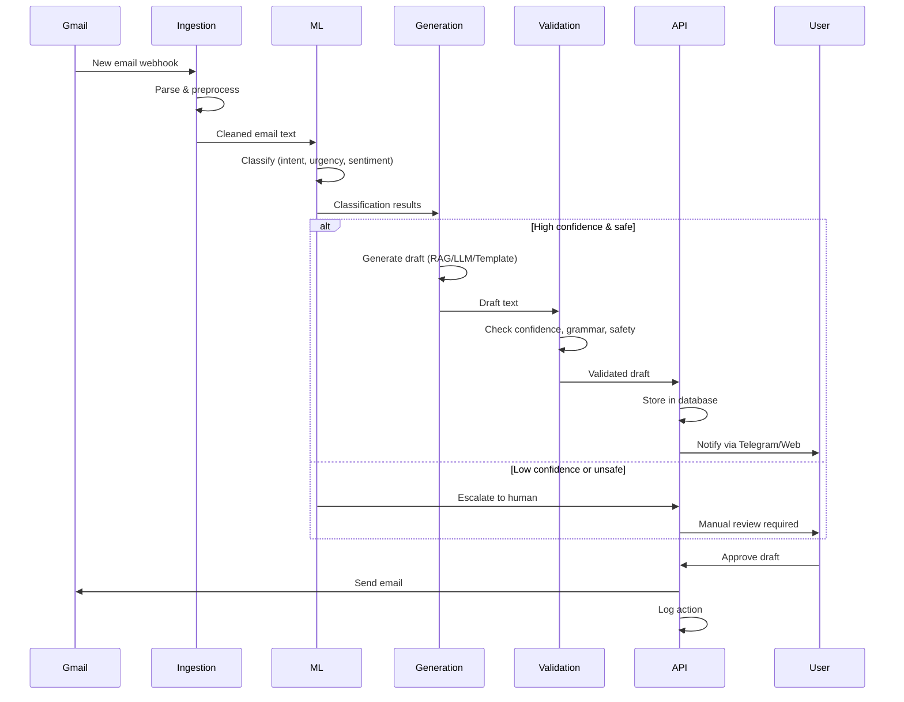

# System Architecture: AI Email Auto-Responder

## Overview

This document describes the technical architecture of the AI Email Auto-Responder system, including component design, data flow, technology stack, and deployment strategy.

---

## High-Level Architecture



---

## Component Details

### 1. Ingestion Layer

#### Email Parser
**Purpose**: Extract structured data from raw emails  
**Technology**: Python `email` library, BeautifulSoup for HTML  
**Responsibilities**:
- Parse MIME messages
- Extract headers (from, to, subject, date)
- Extract body (plain text and HTML)
- Handle attachments metadata
- Identify email threads

**Input**: Raw email from Gmail API  
**Output**: Structured email object
```python
{
    "id": "abc123",
    "sender": "prof@university.edu",
    "recipient": "student@email.com",
    "subject": "Assignment deadline",
    "body": "Hi, the deadline is...",
    "timestamp": "2026-01-10T10:30:00Z",
    "thread_id": "thread_xyz",
    "labels": ["INBOX", "IMPORTANT"]
}
```

#### Text Preprocessor
**Purpose**: Clean and normalize text for ML models  
**Technology**: spaCy, regex  
**Responsibilities**:
- Remove HTML tags and formatting
- Strip email signatures
- Remove quoted replies ("> Previous message")
- Normalize whitespace
- Detect language
- Tokenize for model input

**Input**: Structured email object  
**Output**: Cleaned text + metadata

---

### 2. ML Pipeline

#### BERT Classifier
**Purpose**: Multi-task classification (intent, urgency, sentiment)  
**Technology**: PyTorch, Hugging Face Transformers  
**Model**: `bert-base-uncased` or `roberta-base` fine-tuned  
**Architecture**:
```
Input Text → BERT Encoder → [CLS] Token Embedding
                              ↓
                    ┌─────────┼─────────┐
                    ↓         ↓         ↓
              Intent Head  Urgency  Sentiment
                (8 classes) (4 classes) (4 classes)
```

**Training**:
- Multi-task learning with shared encoder
- Separate classification heads
- Cross-entropy loss per task
- Weighted loss combination

**Inference**:
- Batch size: 16
- Max sequence length: 512 tokens
- Output: Logits + softmax probabilities

**Performance Target**:
- Latency: < 100ms per email
- F1 Score: > 0.85

#### Urgency Detector
**Purpose**: Specialized urgency detection with temporal reasoning  
**Technology**: BERT + rule-based augmentation  
**Features**:
- Deadline extraction (regex patterns)
- Time-sensitive keywords ("ASAP", "urgent", "immediately")
- Sender priority (VIP senders)
- Historical urgency patterns

#### Sentiment Analyzer
**Purpose**: Detect tone and flag aggressive emails  
**Technology**: Fine-tuned sentiment model  
**Classes**: Positive, Neutral, Negative, Aggressive  
**Safety**: Aggressive emails automatically escalated

---

### 3. Generation Layer

#### Template Engine
**Purpose**: Rule-based response generation for common scenarios  
**Technology**: Jinja2 templates  
**Use Cases**:
- High-confidence, simple intents
- Fallback when LLM fails
- Consistent formatting

**Example Template**:
```jinja2
Dear {{ sender_name }},

Thank you for your email regarding {{ subject }}.

I am available at the proposed time. Please send a calendar invite.

I have received your message and will respond with the requested information shortly.


Best regards,
{{ user_signature }}
```

#### LLM Generator
**Purpose**: Neural text generation for complex, context-aware replies  
**Technology**: T5, FLAN-T5, or Mistral-7B fine-tuned  
**Model Selection**:
- **T5-base** (220M params): Fast, good quality
- **FLAN-T5-large** (780M params): Better instruction following
- **Mistral-7B-Instruct** (7B params): Highest quality, slower

**Fine-tuning Strategy**:
- LoRA (Low-Rank Adaptation) for efficiency
- Training data: Email → Reply pairs
- Conditional generation: `[INTENT: academic] [URGENCY: high] Email: ... Reply:`

**Inference**:
- Temperature: 0.7 (balanced creativity/consistency)
- Top-p: 0.9 (nucleus sampling)
- Max length: 300 tokens
- Beam search: 4 beams

#### RAG System
**Purpose**: Retrieve relevant context to augment generation  
**Technology**: FAISS or ChromaDB + Sentence Transformers  
**Architecture**:
```
Query Email → Embed (sentence-transformers)
                ↓
          Vector Search (FAISS)
                ↓
     Retrieve Top-K Documents (k=3)
                ↓
     Augment LLM Prompt with Context
                ↓
          Generate Reply
```

**Knowledge Base**:
- FAQs (company/academic policies)
- Previous email threads
- User-approved templates
- Domain-specific documents

**Embedding Model**: `all-MiniLM-L6-v2` (384 dimensions)

#### Generation Orchestrator
**Purpose**: Coordinate generation strategies with fallback  
**Logic**:
```python
if high_confidence and simple_intent:
    return template_engine.generate()
elif specialized_domain and rag_available:
    context = rag_system.retrieve(email)
    return llm_generator.generate(email, context)
else:
    return llm_generator.generate(email)
```

---

### 4. Validation Layer

#### Confidence Validator
**Purpose**: Ensure predictions meet quality thresholds  
**Logic**:
```python
min_confidence = min(
    intent_confidence,
    urgency_confidence,
    sentiment_confidence
)

if min_confidence < threshold:
    escalate_to_human()
```

**Thresholds** (intent-specific):
- Academic: 0.80
- Internship: 0.75
- Meeting: 0.70
- Spam: 0.90

#### Grammar Checker
**Purpose**: Correct spelling and grammar errors  
**Technology**: LanguageTool API or Grammarly API  
**Process**:
1. Send draft to grammar API
2. Apply corrections
3. Re-score quality

#### Safety Filter
**Purpose**: Prevent inappropriate responses  
**Checks**:
- No profanity or offensive language
- No personal information leakage
- Tone matches user preferences
- Length within bounds (50-500 words)

---

### 5. Decision Engine

**Purpose**: Determine action based on classification and validation  
**Actions**: `AUTO_SEND`, `DRAFT_REVIEW`, `ESCALATE`, `IGNORE`

**Decision Logic**:
```python
if sentiment == "AGGRESSIVE":
    return ESCALATE
elif intent == "SPAM":
    return IGNORE
elif min_confidence < threshold:
    return ESCALATE
elif user_preference == "always_review":
    return DRAFT_REVIEW
else:
    return DRAFT_REVIEW  # Default: human approval
```

---

### 6. Storage Layer

#### PostgreSQL
**Purpose**: Persistent storage for emails, drafts, users  
**Schema**:
```sql
-- Emails table
CREATE TABLE emails (
    id UUID PRIMARY KEY,
    sender VARCHAR(255),
    recipient VARCHAR(255),
    subject TEXT,
    body TEXT,
    timestamp TIMESTAMP,
    thread_id VARCHAR(255),
    intent VARCHAR(50),
    urgency VARCHAR(50),
    sentiment VARCHAR(50),
    confidence FLOAT,
    created_at TIMESTAMP DEFAULT NOW()
);

-- Drafts table
CREATE TABLE drafts (
    id UUID PRIMARY KEY,
    email_id UUID REFERENCES emails(id),
    draft_text TEXT,
    generation_method VARCHAR(50),
    confidence FLOAT,
    status VARCHAR(50),  -- pending, approved, rejected
    created_at TIMESTAMP DEFAULT NOW(),
    updated_at TIMESTAMP DEFAULT NOW()
);

-- Users table
CREATE TABLE users (
    id UUID PRIMARY KEY,
    email VARCHAR(255) UNIQUE,
    preferences JSONB,
    signature TEXT,
    created_at TIMESTAMP DEFAULT NOW()
);
```

#### Redis Cache
**Purpose**: High-speed caching for frequent queries  
**Use Cases**:
- Cache model predictions (TTL: 1 hour)
- Session management
- Rate limiting
- Real-time draft queue

**Keys**:
- `email:{id}:classification` → Classification results
- `draft:{id}` → Draft content
- `user:{id}:session` → User session data

#### Vector Database (FAISS/ChromaDB)
**Purpose**: Semantic search for RAG  
**Storage**: Email embeddings, knowledge base embeddings  
**Index**: HNSW (Hierarchical Navigable Small World) for fast ANN search

---

### 7. API Layer (FastAPI)

#### Endpoints

**Email Processing**
- `POST /api/v1/emails/classify` - Classify email
- `POST /api/v1/emails/generate` - Generate reply
- `POST /api/v1/emails/process` - Full pipeline (classify + generate)

**Draft Management**
- `GET /api/v1/drafts` - List pending drafts
- `GET /api/v1/drafts/{id}` - Get specific draft
- `PUT /api/v1/drafts/{id}` - Update draft
- `POST /api/v1/drafts/{id}/approve` - Approve and send
- `DELETE /api/v1/drafts/{id}` - Reject draft

**User Management**
- `GET /api/v1/users/me` - Get current user
- `PUT /api/v1/users/me/preferences` - Update preferences

**Monitoring**
- `GET /health` - Health check
- `GET /metrics` - Prometheus metrics

#### Authentication
- OAuth2 with JWT tokens
- Gmail API OAuth for email access
- Role-based access control (RBAC)

---

### 8. User Interface

#### React Web UI
**Pages**:
- **Inbox**: List of emails with urgency highlighting
- **Draft Review**: View and edit drafts
- **Settings**: User preferences, signature, thresholds
- **Analytics**: Email statistics, model performance

**Features**:
- Real-time updates (WebSocket)
- Responsive design (mobile-friendly)
- Dark mode support
- Keyboard shortcuts

#### Telegram Bot
**Commands**:
- `/start` - Welcome message
- `/list` - List pending drafts
- `/draft <id>` - View specific draft
- Inline responses: `send`, `modify`, `ignore`

**Notifications**:
- New draft available
- High-urgency email detected
- System alerts

---

## Data Flow

### End-to-End Processing Flow



---

## Technology Stack

### Backend
- **Language**: Python 3.11
- **Framework**: FastAPI
- **ASGI Server**: Uvicorn with Gunicorn
- **ORM**: SQLAlchemy
- **Migration**: Alembic

### Machine Learning
- **Framework**: PyTorch 2.1
- **Transformers**: Hugging Face Transformers
- **Model Serving**: ONNX Runtime (optimized inference)
- **Vector Search**: FAISS or ChromaDB
- **Embeddings**: Sentence Transformers

### Frontend
- **Framework**: React 18 with TypeScript
- **Styling**: TailwindCSS
- **State Management**: React Query
- **HTTP Client**: Axios
- **Build Tool**: Vite

### Database
- **Primary DB**: PostgreSQL 15
- **Cache**: Redis 7
- **Vector DB**: FAISS (in-memory) or ChromaDB

### DevOps
- **Containerization**: Docker, Docker Compose
- **Orchestration**: Kubernetes (future)
- **CI/CD**: GitHub Actions
- **Monitoring**: Prometheus + Grafana
- **Logging**: ELK Stack (Elasticsearch, Logstash, Kibana)

### External APIs
- **Email**: Gmail API
- **Messaging**: Telegram Bot API
- **Grammar**: LanguageTool API

---

## Deployment Architecture

### Development Environment
```
docker-compose.dev.yml
├── backend (FastAPI with hot reload)
├── frontend (Vite dev server)
├── postgres (local instance)
├── redis (local instance)
└── model-server (CPU inference)
```

### Production Environment
```
docker-compose.yml
├── nginx (reverse proxy, SSL termination)
├── backend (Gunicorn + Uvicorn workers)
├── frontend (static build served by Nginx)
├── postgres (persistent volume)
├── redis (persistent volume)
├── model-server (GPU inference with ONNX)
├── prometheus (metrics collection)
└── grafana (visualization)
```

### Scaling Strategy
- **Horizontal Scaling**: Multiple backend replicas behind load balancer
- **Model Serving**: Dedicated GPU instances for inference
- **Database**: Read replicas for query scaling
- **Caching**: Redis cluster for distributed cache

---

## Security Considerations

### Data Protection
- **Encryption at Rest**: PostgreSQL with transparent data encryption
- **Encryption in Transit**: TLS 1.3 for all API calls
- **Email Content**: Encrypted before storage, decrypted only for processing

### Authentication & Authorization
- **OAuth2**: Gmail API access with user consent
- **JWT Tokens**: Stateless authentication for API
- **RBAC**: Role-based permissions (admin, user)

### Privacy
- **Data Retention**: Emails deleted after 30 days (configurable)
- **Anonymization**: PII removed from logs
- **GDPR Compliance**: User data export and deletion

### Model Security
- **Input Validation**: Sanitize all inputs to prevent injection
- **Output Filtering**: Block sensitive information in responses
- **Rate Limiting**: Prevent abuse (100 requests/minute per user)

---

## Performance Optimization

### Model Optimization
- **Quantization**: 8-bit quantization (2x speedup, minimal accuracy loss)
- **ONNX Export**: Optimized inference runtime
- **Batch Processing**: Process multiple emails in parallel
- **Model Caching**: Keep models in GPU memory

### Database Optimization
- **Indexing**: B-tree indexes on frequently queried columns
- **Connection Pooling**: Reuse database connections
- **Query Optimization**: Use EXPLAIN ANALYZE for slow queries
- **Partitioning**: Partition emails table by date

### Caching Strategy
- **L1 Cache**: In-memory Python dict (process-local)
- **L2 Cache**: Redis (shared across instances)
- **Cache Invalidation**: TTL-based + manual invalidation on updates

---

## Monitoring & Observability

### Metrics (Prometheus)
- **Request Metrics**: Latency (p50, p95, p99), throughput, error rate
- **Model Metrics**: Inference time, batch size, GPU utilization
- **Business Metrics**: Draft approval rate, escalation rate, user satisfaction

### Logging (ELK Stack)
- **Application Logs**: Structured JSON logs with trace IDs
- **Audit Logs**: All user actions (approve, reject, modify)
- **Error Logs**: Stack traces, error context

### Alerting
- **Critical**: Service down, database unreachable
- **Warning**: High error rate (>5%), slow response time (p95 > 1s)
- **Info**: Model retrained, new deployment

---

## Disaster Recovery

### Backup Strategy
- **Database**: Daily full backup + continuous WAL archiving
- **Models**: Versioned storage in S3/MinIO
- **Configuration**: Git-based configuration management

### Recovery Plan
- **RTO** (Recovery Time Objective): 1 hour
- **RPO** (Recovery Point Objective): 15 minutes
- **Procedure**: Restore from backup, replay WAL logs, restart services

---

**Document Version**: 1.0  
**Last Updated**: 2026-01-10  
**Owner**: Rayan  
**Status**: Approved
