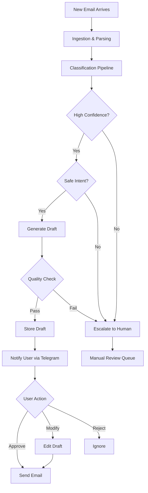

# Product Specification: AI Email Auto-Responder

## Executive Summary

An intelligent, context-aware email automation system that classifies incoming emails, detects urgency and sentiment, and generates safe, confidence-based replies with human escalation for edge cases. This system transforms email management from a manual, time-consuming task into an automated, intelligent workflow.

---

## 1. Use Cases

### Primary Use Cases

#### 1.1 Academic Email Management
**Scenario**: Student receives emails from professors, TAs, and academic departments  
**User Need**: Professional, timely responses to academic inquiries  
**System Behavior**:
- Detect academic context (sender domain `.edu`, keywords like "professor", "assignment")
- Generate formal, respectful replies
- Handle common scenarios: office hours, assignment questions, grade inquiries
- Escalate complex academic matters to human review

**Example**:
- **Input**: "Hi, I wanted to ask about the deadline for the final project. Can I get an extension?"
- **Output**: "Dear Professor [Name], Thank you for your email. I would appreciate the opportunity to discuss the project deadline. Would you be available for a brief meeting to discuss this? Best regards, [User]"

#### 1.2 Internship & Job Application Responses
**Scenario**: Receiving interview invitations, HR follow-ups, application confirmations  
**User Need**: Quick, professional responses to time-sensitive opportunities  
**System Behavior**:
- Identify HR/recruitment emails (keywords: "interview", "application", "position")
- Detect urgency (interview scheduling is high priority)
- Generate enthusiastic, professional replies
- Confirm availability or request alternative times

**Example**:
- **Input**: "We'd like to invite you for an interview on Tuesday at 2 PM. Please confirm your availability."
- **Output**: "Hello [Recruiter], Thank you for the opportunity! I am available on Tuesday at 2 PM and look forward to speaking with you. Please let me know if you need any additional information. Best regards, [User]"

#### 1.3 Meeting Scheduling
**Scenario**: Coordinating meetings with colleagues, mentors, or collaborators  
**User Need**: Efficient scheduling without back-and-forth  
**System Behavior**:
- Detect meeting requests (keywords: "meeting", "schedule", "available")
- Check calendar integration (future enhancement)
- Propose or confirm times
- Send calendar invites

**Example**:
- **Input**: "Are you free for a quick sync on the project next week?"
- **Output**: "Hi [Name], I'd be happy to sync up! I'm available Monday 10-12 PM or Wednesday 2-4 PM. Let me know what works best for you. Thanks, [User]"

#### 1.4 Support Email Handling
**Scenario**: Customer support, help desk, or general inquiries  
**User Need**: Acknowledge receipt and set expectations  
**System Behavior**:
- Detect support requests (keywords: "help", "issue", "problem")
- Send acknowledgment with estimated response time
- Route to appropriate department (if applicable)

**Example**:
- **Input**: "I'm having trouble accessing my account. Can you help?"
- **Output**: "Hello, Thank you for reaching out. I've received your request and will look into this issue. I'll get back to you within 24 hours with a solution. Best, [User]"

#### 1.5 Spam Triage
**Scenario**: Marketing emails, newsletters, unsolicited offers  
**User Need**: Automatically filter and ignore spam  
**System Behavior**:
- Detect spam indicators (keywords: "unsubscribe", "discount", "limited offer")
- Mark as spam or auto-archive
- No reply generated
- Log for review

---

## 2. System Inputs

### 2.1 Raw Email Data

#### Email Text
- **Subject Line**: Primary intent indicator
- **Body**: Full email content (plain text and HTML)
- **Quoted Replies**: Previous conversation context
- **Signature**: Sender information

#### Metadata
- **Sender**: Email address and display name
- **Recipient**: User's email address
- **Timestamp**: When email was received
- **Thread ID**: Conversation thread identifier
- **Labels/Tags**: Gmail labels (if applicable)
- **Attachments**: File names and types (content analysis in future)

### 2.2 User Context

#### User Preferences
- **Tone Settings**: Formal, casual, or adaptive
- **Signature**: Default email signature
- **Auto-reply Rules**: Custom rules for specific senders/domains
- **Escalation Preferences**: Confidence thresholds for human review
- **Blacklist/Whitelist**: Domains to always ignore or prioritize

#### Historical Data
- **Previous Emails**: Past conversations with sender
- **User Corrections**: Feedback on generated drafts
- **Approval Patterns**: Which drafts user typically approves/modifies

### 2.3 Knowledge Base (RAG)
- **FAQs**: Common questions and answers
- **Policies**: Company/academic policies
- **Templates**: Pre-approved response templates
- **Domain Knowledge**: Specialized information (e.g., course syllabi, product docs)

---

## 3. System Outputs

### 3.1 Classification Results

#### Intent Classification
**Labels**: `[Academic, Internship, Meeting, HR, Support, Complaint, Spam, General]`  
**Output Format**:
```json
{
  "intent": "Academic",
  "confidence": 0.87,
  "sub_intent": "Assignment Question"
}
```

#### Urgency Detection
**Labels**: `[Low, Medium, High, Critical]`  
**Output Format**:
```json
{
  "urgency": "High",
  "confidence": 0.92,
  "reasoning": "Contains deadline mention: 'by tomorrow'"
}
```

#### Sentiment Analysis
**Labels**: `[Positive, Neutral, Negative, Aggressive]`  
**Output Format**:
```json
{
  "sentiment": "Neutral",
  "tone": "Professional",
  "confidence": 0.85,
  "flags": []
}
```

### 3.2 Generated Draft Reply

**Output Format**:
```json
{
  "draft": "Dear Professor Smith,\n\nThank you for your email...",
  "generation_method": "LLM",  // or "Template" or "RAG"
  "confidence": 0.88,
  "quality_score": 0.91,
  "word_count": 87,
  "estimated_reading_time": "30 seconds"
}
```

### 3.3 Decision & Recommendation

**Actions**: `[AUTO_SEND, DRAFT_REVIEW, ESCALATE, IGNORE]`  
**Output Format**:
```json
{
  "action": "DRAFT_REVIEW",
  "reason": "High confidence but user prefers review for academic emails",
  "overall_confidence": 0.85,
  "escalation_triggers": [],
  "suggested_modifications": []
}
```

### 3.4 Audit Trail

**Output Format**:
```json
{
  "email_id": "abc123",
  "processing_time_ms": 342,
  "pipeline_stages": [
    {"stage": "ingestion", "duration_ms": 23},
    {"stage": "classification", "duration_ms": 156},
    {"stage": "generation", "duration_ms": 143},
    {"stage": "validation", "duration_ms": 20}
  ],
  "model_versions": {
    "classifier": "bert-v1.2",
    "generator": "t5-v1.0"
  }
}
```

---

## 4. Success Metrics

### 4.1 AI Performance Metrics

#### Classification Accuracy
- **Target**: F1 Score > 0.85 on test set
- **Measurement**: Macro F1 across all intent classes
- **Monitoring**: Weekly evaluation on held-out test set

#### Generation Quality
- **Target**: ROUGE-L > 0.40, BERTScore > 0.75
- **Measurement**: Automated metrics + human evaluation
- **Monitoring**: Sample 50 drafts weekly for human review

#### Confidence Calibration
- **Target**: 90% of high-confidence predictions (>0.8) are correct
- **Measurement**: Calibration curves, Brier score
- **Monitoring**: Track user approval rates by confidence bucket

### 4.2 System Performance Metrics

#### Latency
- **Target**: p95 < 500ms for full pipeline
- **Breakdown**:
  - Classification: < 100ms
  - Generation: < 300ms
  - Validation: < 50ms
- **Monitoring**: Real-time latency tracking with Prometheus

#### Throughput
- **Target**: 100 emails/minute on single GPU
- **Measurement**: Batch processing benchmarks
- **Monitoring**: Track processing queue length

#### Availability
- **Target**: 99.5% uptime
- **Measurement**: Health check monitoring
- **Monitoring**: Alerting on service failures

### 4.3 User Experience Metrics

#### Draft Approval Rate
- **Target**: > 70% of drafts approved without modification
- **Measurement**: Track approve/modify/reject actions
- **Monitoring**: Weekly dashboard review

#### Time Saved
- **Target**: 80% reduction in email response time
- **Baseline**: Average 5 minutes per email manually
- **Goal**: < 1 minute per email with system
- **Measurement**: User surveys + time tracking

#### User Satisfaction
- **Target**: NPS > 8/10
- **Measurement**: Monthly user surveys
- **Monitoring**: Feedback collection and analysis

### 4.4 Safety Metrics

#### Escalation Rate
- **Target**: 15-25% of emails escalated to human review
- **Measurement**: Track ESCALATE decisions
- **Monitoring**: Ensure not too aggressive (>40%) or too lenient (<10%)

#### False Positive Rate (Spam)
- **Target**: < 1% of legitimate emails marked as spam
- **Measurement**: User feedback on spam classification
- **Monitoring**: Weekly review of spam folder

#### Tone Violations
- **Target**: 0 aggressive/inappropriate responses sent
- **Measurement**: Sentiment filter + human review
- **Monitoring**: Flag all negative sentiment drafts for review

---

## 5. Key Features

### 5.1 Core Features (MVP)

- ✅ **Multi-class Intent Classification**: Accurately categorize email purpose
- ✅ **Urgency Detection**: Prioritize time-sensitive emails
- ✅ **Sentiment Analysis**: Detect tone and flag aggressive emails
- ✅ **Draft Generation**: Create contextually appropriate replies
- ✅ **Confidence Scoring**: Provide transparency on prediction certainty
- ✅ **Human-in-the-Loop**: Escalate low-confidence or sensitive emails
- ✅ **Telegram Bot Interface**: Review and approve drafts via Telegram

### 5.2 Advanced Features (Phase 2+)

- 🔄 **RAG Integration**: Retrieve relevant context from knowledge base
- 🔄 **Multi-turn Conversations**: Handle email threads with context
- 🔄 **Calendar Integration**: Auto-schedule meetings
- 🔄 **Attachment Analysis**: Process and reference attachments
- 🔄 **Multi-language Support**: Handle emails in multiple languages
- 🔄 **Personalization**: Learn user's writing style over time
- 🔄 **A/B Testing**: Compare generation strategies
- 🔄 **Analytics Dashboard**: Visualize email patterns and system performance

---

## 6. User Workflows

### 6.1 Automated Processing Workflow



### 6.2 User Review Workflow

1. **Notification**: User receives Telegram notification with draft preview
2. **Review**: User reads original email and generated draft
3. **Decision**:
   - **Approve**: Draft sent immediately
   - **Modify**: User edits draft, then approves
   - **Reject**: Email marked as ignored
4. **Feedback Loop**: User actions improve model over time

---

## 7. Non-Functional Requirements

### 7.1 Security
- **Data Privacy**: Email content encrypted at rest and in transit
- **Authentication**: OAuth2 for Gmail API access
- **Authorization**: Role-based access control
- **Audit Logging**: All actions logged for compliance

### 7.2 Scalability
- **Horizontal Scaling**: Stateless API design for load balancing
- **Caching**: Redis for frequently accessed data
- **Batch Processing**: Queue-based email processing
- **Database Optimization**: Indexed queries, connection pooling

### 7.3 Reliability
- **Error Handling**: Graceful degradation on model failures
- **Retry Logic**: Exponential backoff for transient failures
- **Health Checks**: Automated service monitoring
- **Backup & Recovery**: Database backups, disaster recovery plan

### 7.4 Maintainability
- **Code Quality**: Type hints, linting, formatting
- **Testing**: Unit tests (>80% coverage), integration tests
- **Documentation**: API docs, architecture diagrams, runbooks
- **Versioning**: Semantic versioning for models and API

---

## 8. Future Enhancements

### 8.1 Short-term (3-6 months)
- **Mobile App**: Native iOS/Android app for draft review
- **Voice Commands**: "Approve all low-priority drafts"
- **Smart Scheduling**: AI-powered meeting time suggestions
- **Template Library**: User-curated response templates

### 8.2 Long-term (6-12 months)
- **Multi-user Support**: Team collaboration features
- **Advanced Analytics**: Email pattern insights, productivity metrics
- **Integration Marketplace**: Slack, Discord, Microsoft Teams
- **Custom Model Training**: Fine-tune on user's email history
- **Proactive Suggestions**: "You haven't replied to this urgent email"

---

## 9. Constraints & Assumptions

### 9.1 Constraints
- **Gmail API Limits**: 250 quota units/user/second
- **Model Size**: Must fit in 8GB GPU memory for inference
- **Latency**: User expects response within 1 second
- **Cost**: Minimize cloud compute costs (prefer on-prem deployment)

### 9.2 Assumptions
- **Email Volume**: User receives 20-50 emails/day
- **Internet Access**: System requires internet for Gmail API
- **User Availability**: User reviews drafts within 24 hours
- **Language**: Primary language is English (multi-language future)

---

## 10. Success Criteria

### Phase 1 (MVP) Success
- ✅ System correctly classifies 85%+ of test emails
- ✅ Generated drafts approved without modification 60%+ of time
- ✅ No inappropriate/aggressive responses sent
- ✅ User saves 3+ hours/week on email management
- ✅ System processes emails in < 1 second

### Production Readiness
- ✅ 99% uptime over 30 days
- ✅ Zero data breaches or security incidents
- ✅ User satisfaction score > 8/10
- ✅ Successfully handles 1000+ emails without manual intervention
- ✅ Complete documentation and deployment guide

---

**Document Version**: 1.0  
**Last Updated**: 2026-01-10  
**Owner**: Rayan  
**Status**: Approved
